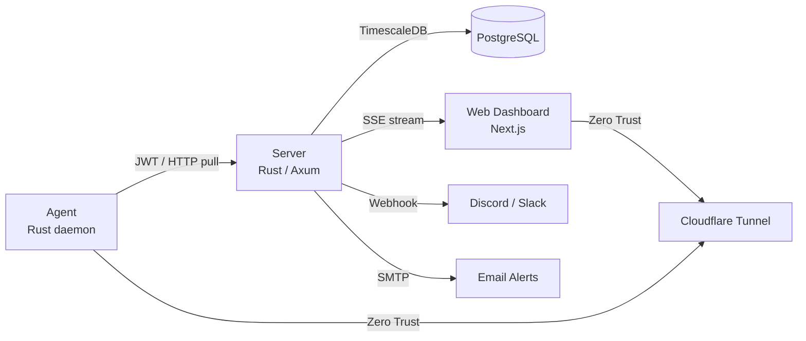

# network-monitor

> Real-time server infrastructure monitoring — lightweight, self-hosted, and zero-trust.


---

## Overview

**network-monitor** is a pull-based server monitoring system built with Rust and Next.js. A central server scrapes lightweight agents installed on each target host, stores metrics in TimescaleDB, and streams real-time data to the web dashboard via SSE.

**Key features:**
- CPU, memory, disk, load average time-series charts
- Top process monitoring (CPU/memory sorted)
- Temperature sensor monitoring
- NVIDIA GPU usage, VRAM, and temperature tracking
- Docker container status tracking
- Port open/closed monitoring
- Multi-channel alert notifications (Discord, Slack, Email)
- Disk usage alerts with per-mount-point tracking
- Alert history logging and browsing
- Per-host and global alert configuration via web UI
- Uptime history with daily breakdown
- Public status page (no auth required)
- Dark mode support with system preference detection
- i18n: English (default) + Korean
- HTTP endpoint monitoring (response time, status code, uptime tracking)
- Ping/TCP reachability monitoring for network devices
- User authentication with Argon2 password hashing and JWT sessions
- Zero-Trust deployment via Cloudflare Tunnel (no exposed host ports)

---

## Architecture



**Data flow:**
1. Server scrapes each registered agent every 10 s (configurable)
2. Metrics stored in TimescaleDB with 90-day retention
3. Browser connects to SSE stream for real-time updates (10 s push)
4. REST API available for historical range queries
5. Alerts delivered to Discord, Slack, and/or Email channels

---

## Monorepo Structure

```
network-monitor/
├── network-monitor-server/   # Rust/Axum backend (metrics API, scraper, alerts)
├── network-monitor-web/      # Next.js frontend dashboard (git submodule)
└── network-monitor-agent/    # Rust agent daemon (git submodule)
```

---

## Quick Start

### Prerequisites
- Docker & Docker Compose
- A [Cloudflare Tunnel](https://developers.cloudflare.com/cloudflare-one/connections/connect-networks/) token (optional — remove the `tunnel` service for local-only use)

### 1. Clone with submodules

```bash
git clone --recurse-submodules https://github.com/sounmu/network-monitor.git
cd network-monitor
```

### 2. Configure environment

```bash
cp .env.example .env
cp network-monitor-server/.env.example network-monitor-server/.env
```

Edit both `.env` files and fill in:
- `POSTGRES_PASSWORD` — strong password for PostgreSQL
- `JWT_SECRET` — 32+ byte random hex (`openssl rand -hex 32`)
- `WEB_API_KEY` — random string for dashboard auth
- `DISCORD_WEBHOOK_URL` — your Discord incoming webhook URL
- `CLOUDFLARE_TUNNEL_TOKEN` — from Cloudflare Zero Trust dashboard

### 3. Create the shared Docker network

```bash
docker network create shared-network
```

### 4. Start the stack

```bash
docker compose up -d --build
```

The dashboard is available at `http://localhost:3001` (or via your Cloudflare Tunnel domain).

---

## Running Without Docker (Development)

### Server

```bash
cd network-monitor-server
cp .env.example .env  # fill in values
cargo run
# Runs on http://0.0.0.0:3000 by default
```

### Web Dashboard

```bash
cd network-monitor-web
cp .env.example .env  # fill in NEXT_PUBLIC_API_URL
npm install
npm run dev
# Runs on http://localhost:3001
```

### Agent

```bash
cd network-monitor-agent
cp .env.example .env  # fill in JWT_SECRET matching the server
cargo run
# Listens on http://0.0.0.0:9101 by default
```

---

## Environment Variables

### Root `.env` (Docker Compose)

| Variable | Required | Default | Description |
|---|---|---|---|
| `POSTGRES_USER` | No | `postgres` | DB username |
| `POSTGRES_PASSWORD` | **Yes** | — | DB password |
| `POSTGRES_DB` | No | `network_monitor` | DB name |
| `CLOUDFLARE_TUNNEL_TOKEN` | No | — | Cloudflare Tunnel token |
| `NEXT_PUBLIC_API_URL` | No | `http://localhost:3000` | Backend URL seen by browser |
| `NEXT_PUBLIC_WEB_API_KEY` | **Yes** | — | Dashboard auth key |

### Server `network-monitor-server/.env`

| Variable | Required | Default | Description |
|---|---|---|---|
| `DATABASE_URL` | **Yes** | — | PostgreSQL connection string |
| `JWT_SECRET` | **Yes** | — | HS256 secret for agent JWT auth |
| `WEB_API_KEY` | **Yes** | — | Static API key for dashboard |
| `DISCORD_WEBHOOK_URL` | No | — | Discord webhook for alerts (env-based) |
| `ALLOWED_ORIGINS` | No | `http://localhost:3001` | Comma-separated CORS origins |
| `SERVER_HOST` | No | `0.0.0.0` | Bind address |
| `SERVER_PORT` | No | `3000` | Bind port |
| `SCRAPE_INTERVAL_SECS` | No | `10` | How often to pull each agent |
| `MAX_DB_CONNECTIONS` | No | `10` | PostgreSQL pool size |
| `SSE_BUFFER_SIZE` | No | `128` | SSE broadcast channel buffer |

### Agent `network-monitor-agent/.env`

| Variable | Required | Default | Description |
|---|---|---|---|
| `JWT_SECRET` | **Yes** | — | Must match server's `JWT_SECRET` |
| `AGENT_PORT` | No | `9100` | Port the agent HTTP server listens on |
| `AGENT_HOSTNAME` | No | OS hostname | Display name shown in dashboard |
| `MONITOR_PORTS` | No | `80,443` | Comma-separated ports to check |

---

## API Endpoints

All endpoints require `Authorization: Bearer <JWT or WEB_API_KEY>` unless noted.

| Method | Path | Description |
|---|---|---|
| `POST` | `/api/auth/login` | Login **(no auth)** |
| `POST` | `/api/auth/setup` | Create initial admin **(no auth, first run only)** |
| `GET` | `/api/auth/me` | Current user info |
| `GET` | `/api/auth/status` | Check if setup needed **(no auth)** |
| `GET` | `/api/hosts` | List all hosts with online status |
| `GET` | `/api/hosts/{host_key}` | Get a single host configuration |
| `POST` | `/api/hosts` | Register a new host |
| `PUT` | `/api/hosts/{host_key}` | Update host configuration |
| `DELETE` | `/api/hosts/{host_key}` | Delete a host |
| `GET` | `/api/metrics/{host_key}` | Recent 50 metric rows |
| `GET` | `/api/metrics/{host_key}?start=&end=` | Metrics in a time range (ISO 8601) |
| `GET` | `/api/uptime/{host_key}?days=` | Daily uptime breakdown |
| `GET` | `/api/alert-configs` | Global alert defaults |
| `PUT` | `/api/alert-configs` | Update global defaults |
| `GET` | `/api/alert-configs/{host_key}` | Host-specific alert overrides |
| `PUT` | `/api/alert-configs/{host_key}` | Upsert host alert overrides |
| `DELETE` | `/api/alert-configs/{host_key}` | Delete host overrides |
| `GET` | `/api/notification-channels` | List notification channels |
| `POST` | `/api/notification-channels` | Create channel |
| `PUT` | `/api/notification-channels/{id}` | Update channel |
| `DELETE` | `/api/notification-channels/{id}` | Delete channel |
| `POST` | `/api/notification-channels/{id}/test` | Send test notification |
| `GET` | `/api/alert-history?host_key=&limit=` | Alert event log |
| `GET` | `/api/http-monitors` | List HTTP monitors |
| `POST` | `/api/http-monitors` | Create HTTP monitor |
| `GET` | `/api/http-monitors/summaries` | HTTP monitor summaries |
| `PUT` | `/api/http-monitors/{id}` | Update HTTP monitor |
| `DELETE` | `/api/http-monitors/{id}` | Delete HTTP monitor |
| `GET` | `/api/http-monitors/{id}/results` | HTTP check results |
| `GET` | `/api/ping-monitors` | List Ping monitors |
| `POST` | `/api/ping-monitors` | Create Ping monitor |
| `GET` | `/api/ping-monitors/summaries` | Ping monitor summaries |
| `PUT` | `/api/ping-monitors/{id}` | Update Ping monitor |
| `DELETE` | `/api/ping-monitors/{id}` | Delete Ping monitor |
| `GET` | `/api/ping-monitors/{id}/results` | Ping check results |
| `GET` | `/api/public/status` | Public status page data **(no auth)** |
| `GET` | `/api/stream?key=<WEB_API_KEY>` | SSE stream (`metrics` + `status`) |

---

## Database Schema

| Table | Description |
|---|---|
| **`metrics`** | TimescaleDB hypertable, 90-day retention, 1-day chunks. Stores CPU, memory, load, network, disk, process, temperature, GPU, Docker, port data as JSONB. |
| **`hosts`** | Agent registry (scrape interval, thresholds, monitored ports/containers) |
| **`alert_configs`** | Alert rules; `NULL host_key` = global default, per-host rows override. Supports cpu/memory/disk metric types. |
| **`notification_channels`** | Alert delivery targets (Discord webhook, Slack webhook, Email SMTP). Config stored as JSONB. |
| **`users`** | User accounts with Argon2 password hashing. Roles: admin, viewer. |
| **`alert_history`** | Immutable log of all alert events with timestamps. |
| **`http_monitors`** | External HTTP endpoint monitors with check intervals. |
| **`http_monitor_results`** | HTTP check results (status code, response time, errors). |
| **`ping_monitors`** | Network host reachability monitors (TCP connect). |
| **`ping_results`** | Ping check results (RTT, success/failure). |

---

## Tech Stack

| Component | Technology |
|---|---|
| Backend | Rust, Axum 0.8, sqlx 0.8, TimescaleDB, lettre (SMTP) |
| Frontend | Next.js 16, React 19, Recharts, SWR |
| Agent | Rust, tokio, sysinfo, bollard (Docker), nvml-wrapper (NVIDIA GPU) |
| Database | PostgreSQL 15 + TimescaleDB extension |
| Deployment | Docker Compose, Cloudflare Tunnel |

---

## Contributing

See [CONTRIBUTING.md](./CONTRIBUTING.md) for development setup, coding conventions, and the PR process.

---

## License

[MIT](./LICENSE) © 2026 sounmu
