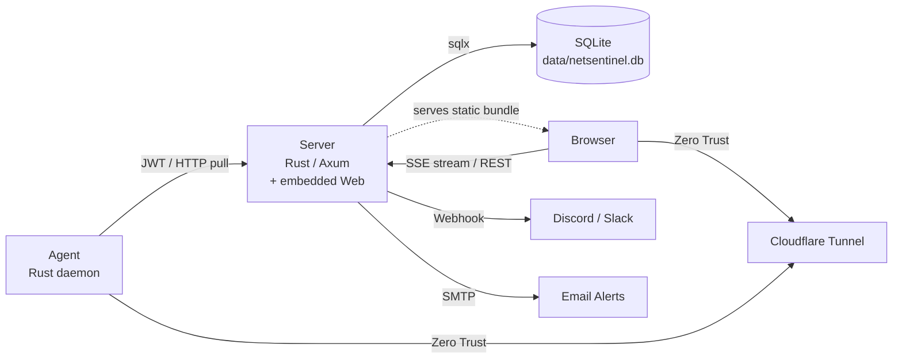

# NetSentinel

> Lightweight homelab monitoring for people who want one container, one SQLite file, and real host metrics without wiring Prometheus, Grafana, Alertmanager, and Uptime Kuma together.


---

## Project Status

NetSentinel is an early self-hosted project aimed at homelab and small-server monitoring. The current focus is installation simplicity, dependable local storage, and clear contracts between hub, agent, and dashboard. Expect rapid iteration, but the default path is intentionally boring: Docker Compose for the hub, native systemd/launchd for agents, and SQLite for state.

---

## Why NetSentinel?

Most monitoring stacks are excellent once you are operating a fleet. They are not always fun when you have a NAS, a mini PC, a Raspberry Pi, a Docker host, and a few services behind Tailscale or Cloudflare Tunnel.

**NetSentinel** is built for that smaller shape: a self-hosted hub that pulls metrics from native Rust agents, stores everything in an embedded SQLite database, serves the dashboard from the same container, and sends alerts without needing a separate metrics database or dashboard stack.

Good fit if you want:

- A single Docker Compose service for the hub: API, dashboard, auth, alerts, and SQLite in one container.
- A native Linux/macOS agent that reports CPU, memory, load, disks, processes, network, Docker containers, temperatures, and optional GPU metrics.
- Pull-based monitoring over LAN, Tailscale, or Cloudflare Tunnel, with JWT auth between hub and agents.
- Simple backups: copy `data/netsentinel.db` instead of managing a database container.
- Built-in HTTP/TCP uptime checks and Discord, Slack, or Email alerts.
- A dashboard that works out of the box without provisioning Grafana panels.

Not trying to replace:

- Prometheus/Grafana for large fleets, high-cardinality metrics, PromQL, or long-term observability pipelines.
- Full incident-management systems with on-call rotations and escalation policies.
- Log aggregation tools like Loki, ELK, or OpenSearch.

## Highlights

- **One container + one file.** The hub keeps metrics, users, host config, alert rules, monitor checks, and dashboard layout in `data/netsentinel.db` using SQLite WAL mode.
- **No exposed agent ports required.** The hub pulls from agents over private networks or tunnels. A common setup is `host_key = <tailscale-ip>:9101`.
- **Efficient agent protocol.** Agents serve gzipped `bincode` over HTTP, which keeps scrape payloads small over tunneled links.
- **SQLite rollups instead of TimescaleDB.** Raw 10-second metrics are retained briefly, 5-minute rollups are kept longer, and long-range charts query the smaller rollup table.
- **Real-time dashboard.** SSE pushes status and live metrics; the client batches updates to avoid render storms.
- **Docker-aware without heavy polling.** The agent uses Docker events for container lifecycle state and polls container stats separately.
- **Native agents first, Docker agents later.** Native installation gives the most accurate host view. Dockerized agents can be supported as a convenience mode for Linux homelabs.

---

## Architecture



The production hub is a **single container**: Axum serves both `/api/*` and the statically exported Next.js dashboard, while SQLite stores state under `/app/data/netsentinel.db`. Local development is still split for convenience: run the Rust server on port 3000 and the Next.js dev server on port 3001.

**Frontend route contract:** the host detail page is now the static route `/host/?key=<host_key>`. Because the bundle is exported as plain HTML with `trailingSlash: true`, the canonical URL keeps the trailing slash and the `host_key` is passed as a query parameter — resolved client-side via `useSearchParams()` instead of being encoded as a dynamic path segment.

**Data flow:**
1. Server schedules each registered agent by that host's `scrape_interval_secs` (10 s by default), batch-inserts metrics in a single query
2. Raw metrics stored in SQLite (3-day retention) + a 5-min rollup table (90-day retention) maintained by an in-process `rollup_worker` running on a 60-second tick. A daily `retention_worker` prunes each time-series table past its window.
3. Browser loads the static bundle from the same origin as the API, then connects to the SSE stream for real-time updates (in-memory — no DB hit, rAF-batched). SSE `metrics` event includes CPU, memory, load, network rate + cumulative counters, disks, temperatures, and Docker stats for live chart overlay; long-lived streams are cut when the session is revoked
4. REST API with automatic downsampling: ≤6h raw, 6h-14d 5-min rollup, >14d 15-min re-aggregation
5. Alerts delivered to Discord, Slack, and/or Email channels

---

## Monorepo Structure

```
netsentinel/
├── server/   # Rust/Axum backend — metrics API, scraper, alerts,
│             # and (in prod) the embedded web static bundle
├── web/      # Next.js dashboard — compiled to `output: 'export'`
│             # and baked into the server image at build time
└── agent/    # Rust agent daemon
```

---

## Quick Start

### Install the hub (one line)

On the machine that will run the dashboard + API:

```bash
curl -fsSL https://raw.githubusercontent.com/sounmu/netsentinel/main/scripts/install-hub.sh | bash
```

It clones the repo into `~/netsentinel`, generates `.env` with random secrets, pulls the published `ghcr.io/sounmu/netsentinel-server` image, starts the hub, verifies the install with a 5-check smoke test, and prints the URL + the JWT_SECRET you'll need for the agent step below.

Prerequisites: Docker + Compose v2, `git`, `curl`, `openssl`. Tested on Linux and macOS; Windows users should run this inside WSL2.

### Install an agent on every monitored host (one line)

On each target machine, paste the JWT_SECRET the hub printed:

```bash
curl -fsSL https://raw.githubusercontent.com/sounmu/netsentinel/main/scripts/install-agent.sh \
  | sudo bash -s -- \
      --jwt-secret "PASTE_THE_HUB_SECRET_HERE" \
      --bind "0.0.0.0" \
      --port 9101
```

Use `--bind "100.x.y.z"` to listen only on the agent's Tailscale interface, or change `--port` and register the matching `<agent-ip>:<port>` in the hub. The installer downloads the matching prebuilt agent from GitHub Releases, verifies `SHA256SUMS`, drops a systemd unit (Linux) or launchd daemon (macOS), starts the service, and prints the exact `host_key` you should paste into the hub's Agents page. Re-run the same command later with `--ref <release-tag>` to pin or update the native agent in place.

> Need an unreleased branch or local fork? Add `--build-from-source --ref <branch-or-tag>`; that path requires `git` and the Rust toolchain.

### Register the host in the UI

1. Open `http://<hub-ip>:3000/setup` → create the first admin account.
2. Navigate to **Agents → + Add Agent** and paste the `host_key` the agent installer printed (for example `192.168.1.10:9101`).
3. The host flips from `pending` → `online` within one scrape interval (default 10 s).

Full walkthrough with troubleshooting: [`docs/AFTER_INSTALL.md`](docs/AFTER_INSTALL.md).

### Update

Both installers are idempotent — re-running them is the supported update path. The `update-*.sh` helpers wrap that for you so you do not have to remember image tags or paste the JWT_SECRET again.

**Hub** (run on the dashboard host):

```bash
# latest published image
bash ~/netsentinel/scripts/update-hub.sh

# pin to a specific release
bash ~/netsentinel/scripts/update-hub.sh --version v0.5.1

# only refresh the docker image, do not touch local repo (CI / cron)
bash ~/netsentinel/scripts/update-hub.sh --skip-git-pull
```

It runs `git pull --ff-only`, `docker compose pull server`, recreates the container, and runs the smoke test. SQLite data, `.env`, and any `docker-compose.override.yml` are left alone (the `data/` directory is bind-mounted, so it survives container recreation).

**Agent** (run on every monitored host):

```bash
curl -fsSL https://raw.githubusercontent.com/sounmu/netsentinel/main/scripts/update-agent.sh \
  | sudo bash                                  # → latest release

curl -fsSL https://raw.githubusercontent.com/sounmu/netsentinel/main/scripts/update-agent.sh \
  | sudo bash -s -- --ref v0.5.1               # → pinned tag
```

It reads `JWT_SECRET` / `AGENT_PORT` / `AGENT_BIND` back from `/etc/netsentinel/agent.env`, re-runs the installer with those values, swaps the binary in place, and restarts the systemd unit (Linux) or launchd daemon (macOS). Pass `--build-from-source --ref <branch>` to test an unreleased fix.

### Remove

**Hub** — default keeps the SQLite DB and `.env` so a re-install resumes seamlessly; pass `--purge` to wipe everything.

```bash
bash ~/netsentinel/scripts/remove-hub.sh                  # stop the stack only
bash ~/netsentinel/scripts/remove-hub.sh --purge --remove-image -y   # full wipe
```

**Agent** — stops the service and removes the binary, config (`/etc/netsentinel/`), unit file, and log dir.

```bash
curl -fsSL https://raw.githubusercontent.com/sounmu/netsentinel/main/scripts/remove-agent.sh \
  | sudo bash
```

Equivalent to `sudo install-agent.sh --uninstall` — pick whichever is on hand.

### If something goes wrong

```bash
cd ~/netsentinel
./scripts/doctor.sh        # laddered diagnosis, tells you the exact recovery command
```

### Manual install

When you do not want to pipe the installer into a shell, run the same steps by hand:

```bash
git clone https://github.com/sounmu/netsentinel.git
cd netsentinel
./scripts/bootstrap.sh            # generates .env
docker compose pull server
docker compose up -d server
./scripts/smoke-test.sh
```

---

## Running without Docker (development only)

Use this path when you are actively changing code. For production homelab installs, the Quick Start above is faster and safer.

### Server (port 3000)

```bash
cd server
cp .env.example .env   # set JWT_SECRET; DATABASE_URL defaults to sqlite://./data/netsentinel.db
mkdir -p data          # SQLite needs the parent directory to exist
cargo run
```

### Web dashboard (port 3001, HMR)

```bash
cd web
cp .env.example .env.local   # NEXT_PUBLIC_API_URL=http://localhost:3000
npm install
npm run dev
```

`npm run dev` runs the full Next.js dev server — dynamic routes, fast refresh, everything. The `output: 'export'` + Axum-embed layout only kicks in when the production image is built.

### Agent (port 9101)

```bash
cd agent
cp .env.example .env   # JWT_SECRET must match the server
cargo run
```

---

## Environment Variables

### Root `.env` (Docker Compose)

| Variable | Required | Default | Description |
|---|---|---|---|
| `JWT_SECRET` | **Yes** | — | HS256 secret (≥ 32 chars). Every agent needs the same value. `bootstrap.sh` generates it via `openssl rand -hex 32`. |
| `NETSENTINEL_VERSION` | No | `latest` | Docker image tag for `ghcr.io/sounmu/netsentinel-server`. Pin a release tag such as `v0.4.2` for reproducible installs. |
| `CLOUDFLARE_TUNNEL_TOKEN` | No | — | Cloudflare Tunnel token. Only read when you activate the `tunnel` service via a compose override — see [`docs/DEPLOYMENT.md`](docs/DEPLOYMENT.md). |
| `NEXT_PUBLIC_API_URL` | No | empty (same-origin) | Build-time web setting for custom local images. The published image is built for same-origin deployments, which is the recommended homelab path. Split-origin deployments should either build a custom image via a `docker-compose.override.yml` (see [`docs/DEPLOYMENT.md`](docs/DEPLOYMENT.md)) or put dashboard/API behind one reverse-proxy hostname. |

> Upgrading from v0.3.x? The old `POSTGRES_USER` / `POSTGRES_PASSWORD` / `POSTGRES_DB` variables are no longer read — remove them from `.env`. There is nothing to migrate if this is a greenfield install. See the v0.4.0 section of [`CHANGELOG.md`](./CHANGELOG.md) for how to move data from an existing Postgres deployment.

### Server — all keys below

Under Docker Compose the server reads **root `.env`** (via `env_file: .env` in `docker-compose.yml`). `server/.env` is only consulted by a local `cargo run`. So add these keys to `./env` for a Docker install, or to `server/.env` for a local dev install — never both.

| Variable | Required | Default | Description |
|---|---|---|---|
| `DATABASE_URL` | **Docker: auto** / **local: yes** | — | SQLite connection URL. `docker-compose.yml` hard-codes `sqlite:///app/data/netsentinel.db` — a local `cargo run` has to set it explicitly (`sqlite://./data/netsentinel.db`). The parent directory must exist; the `.db` file (plus `-wal` / `-shm` sidecars) is created on first boot. |
| `ALLOWED_ORIGINS` | No | `http://localhost:3001` | Comma-separated CORS origins. With the single-container layout this mostly only gates third-party embeds; split-origin deployments must list both hostnames — see [`docs/DEPLOYMENT.md`](docs/DEPLOYMENT.md). No trailing slash, no `*`. |
| `SERVER_HOST` | No | `0.0.0.0` | Bind address |
| `SERVER_PORT` | No | `3000` | Bind port |
| `SCRAPE_INTERVAL_SECS` | No | `10` | Fallback scrape interval if a host row has no valid `scrape_interval_secs`; normal scheduling is per-host |
| `MAX_DB_CONNECTIONS` | No | `10` | sqlx connection pool size. SQLite serialises writes via a single writer lock, so values beyond ~10 provide no throughput gain and only grow idle pool memory. |
| `SSE_BUFFER_SIZE` | No | `128` | SSE broadcast channel buffer; floor is 128, so env can raise but not lower it |
| `TRUSTED_PROXY_COUNT` | No | `0` | Reverse proxy count for X-Forwarded-For (0 = use peer IP directly) |
| `METRICS_CACHE_MAX_ENTRIES` | No | `20` | Max in-memory query-cache entries per cache (raw ≤6h ranges are not server-cached; TTL 120 s) |
| `METRICS_CACHE_MAX_BYTES` | No | `33554432` | Estimated byte budget per metrics query cache (default 32 MiB). Oldest entries are evicted when either the entry cap or byte cap is exceeded |
| `SQLITE_MMAP_SIZE` | No | `67108864` | SQLite mmap size in bytes (default 64 MiB) |
| `SQLITE_CACHE_SIZE_KB` | No | `8192` | SQLite page cache size in KiB (default 8 MiB; applied as negative `cache_size`) |
| `SQLITE_TEMP_STORE` | No | `MEMORY` | SQLite temp storage mode: `DEFAULT`, `FILE`, or `MEMORY` |
| `COOKIE_SECURE` | No | `true` | Whether the refresh cookie carries the `Secure` flag. Leave enabled in production; set `false` only for local plain-HTTP development. |
| `METRICS_TOKEN` | No | — | Bearer token for `/metrics` (Prometheus). When set, every scrape must send `Authorization: Bearer <token>`. |
| `ALLOW_UNAUTHENTICATED_METRICS` | No | `false` | Explicit opt-in to leave `/metrics` open when `METRICS_TOKEN` is unset. |

### Agent `agent/.env`

| Variable | Required | Default | Description |
|---|---|---|---|
| `JWT_SECRET` | **Yes** | — | Must match server's `JWT_SECRET` |
| `AGENT_PORT` | No | `9101` | Port the agent HTTP server listens on |
| `AGENT_BIND` | No | `0.0.0.0` | Bind address. Use a Tailscale IP such as `100.x.y.z` to expose the native agent only on that interface. |

---

## API Endpoints

All endpoints require `Authorization: Bearer <JWT>` unless noted. Read endpoints use `UserGuard` (rejects agent JWTs). Mutation endpoints require `AdminGuard` (admin role only).

| Method | Path | Description |
|---|---|---|
| `POST` | `/api/auth/login` | Login **(no auth)** |
| `POST` | `/api/auth/setup` | Create initial admin **(no auth, first run only)** |
| `GET` | `/api/auth/me` | Current user info |
| `GET` | `/api/auth/status` | Check if setup needed **(no auth)** |
| `PUT` | `/api/auth/password` | Change current user's password |
| `GET` | `/api/health` | Health check — verifies DB **(no auth)** |
| `GET` | `/api/dashboard` | Get user's dashboard layout |
| `PUT` | `/api/dashboard` | Save user's dashboard layout |
| `GET` | `/api/hosts` | List all hosts with online status |
| `GET` | `/api/hosts/{host_key}` | Get a single host configuration |
| `POST` | `/api/hosts` | Register a new host |
| `PUT` | `/api/hosts/{host_key}` | Update host configuration |
| `DELETE` | `/api/hosts/{host_key}` | Delete a host |
| `GET` | `/api/metrics/{host_key}` | Recent 50 metric rows |
| `GET` | `/api/metrics/{host_key}?start=&end=` | Metrics in a time range (ISO 8601) |
| `GET` | `/api/metrics/{host_key}/chart?start=&end=` | Lightweight chart rows for host detail graphs (≤1h raw, >1h 5-min rollup, >14d 15-min re-aggregation) |
| `POST` | `/api/metrics/batch` | Batch metrics for multiple hosts (max 50) |
| `GET` | `/api/uptime/{host_key}?days=` | Daily uptime breakdown |
| `GET` | `/api/alert-configs` | Global alert defaults |
| `PUT` | `/api/alert-configs` | Update global defaults |
| `GET` | `/api/alert-configs/{host_key}` | Host-specific alert overrides |
| `PUT` | `/api/alert-configs/{host_key}` | Upsert host alert overrides |
| `DELETE` | `/api/alert-configs/{host_key}` | Delete host overrides |
| `GET` | `/api/notification-channels` | List notification channels |
| `POST` | `/api/notification-channels` | Create channel |
| `PUT` | `/api/notification-channels/{id}` | Update channel |
| `DELETE` | `/api/notification-channels/{id}` | Delete channel |
| `POST` | `/api/notification-channels/{id}/test` | Send test notification |
| `GET` | `/api/alert-history?host_key=&limit=` | Alert event log |
| `GET` | `/api/http-monitors` | List HTTP monitors |
| `POST` | `/api/http-monitors` | Create HTTP monitor |
| `GET` | `/api/http-monitors/summaries` | HTTP monitor summaries |
| `PUT` | `/api/http-monitors/{id}` | Update HTTP monitor |
| `DELETE` | `/api/http-monitors/{id}` | Delete HTTP monitor |
| `GET` | `/api/http-monitors/{id}/results` | HTTP check results |
| `GET` | `/api/ping-monitors` | List Ping monitors |
| `POST` | `/api/ping-monitors` | Create Ping monitor |
| `GET` | `/api/ping-monitors/summaries` | Ping monitor summaries |
| `PUT` | `/api/ping-monitors/{id}` | Update Ping monitor |
| `DELETE` | `/api/ping-monitors/{id}` | Delete Ping monitor |
| `GET` | `/api/ping-monitors/{id}/results` | Ping check results |
| `GET` | `/api/public/status` | Public status page data **(no auth)** |
| `GET` | `/metrics` | Prometheus metrics export (**auth required by default** — set `METRICS_TOKEN`, or explicitly opt in via `ALLOW_UNAUTHENTICATED_METRICS=true`) |
| `POST` | `/api/auth/logout` | Revoke all tokens for current user |
| `POST` | `/api/auth/refresh` | Rotate refresh cookie + mint fresh access JWT (cookie is the credential; no auth header) |
| `POST` | `/api/auth/sse-ticket` | Mint single-use ticket for SSE |
| `POST` | `/api/admin/users/{id}/revoke-sessions` | Admin: force-revoke user sessions |
| `GET` | `/api/stream?key=<ticket>` | SSE stream (`metrics` + `status`) |

Frontend permalink contract:
- Host detail: `/host/?key=<host_key>`
- Example: `/host/?key=192.168.1.10:9101`

---

## Database Schema

All tables live in a single SQLite file (`data/netsentinel.db`, WAL mode, STRICT + WITHOUT ROWID on hot paths). Time-series tables are pruned by the in-process `retention_worker`; there is no hypertable or continuous aggregate — see [`docs/SQLITE_MIGRATION.md`](docs/SQLITE_MIGRATION.md) for the design rationale.

| Table | Description |
|---|---|
| **`metrics`** | Raw scrape rows. 3-day retention. Stores CPU, memory, load, network, disk, process, temperature, GPU, Docker, port data as JSON text columns, plus nullable scalar `rx_bytes_per_sec` / `tx_bytes_per_sec` projections for bandwidth rollups. |
| **`metrics_5min`** | 5-minute rollup table (`STRICT, WITHOUT ROWID`, PK `(host_key, bucket)`). Populated by `services::rollup_worker` on a 60-second tick via an idempotent UPSERT from `metrics`; includes cumulative network counters and bucket-averaged bandwidth scalar columns. 90-day retention. |
| **`hosts`** | Agent registry (scrape interval, thresholds, monitored ports/containers, system info: OS/CPU/RAM/IP). `ports` / `containers` stored as JSON arrays in TEXT columns. |
| **`alert_configs`** | Alert rules; `NULL host_key` = global default, per-host rows override. `UNIQUE NULLS NOT DISTINCT` is emulated with an expression-based UNIQUE INDEX on `(coalesce(host_key, ''), metric_type, coalesce(sub_key, ''))`. |
| **`notification_channels`** | Alert delivery targets (Discord webhook, Slack webhook, Email SMTP). Config stored as JSON text. |
| **`dashboard_layouts`** | Per-user dashboard widget layout (JSON text). |
| **`users`** | User accounts with Argon2 password hashing. Roles: admin, viewer. Tracks `password_changed_at` and `tokens_revoked_at` for unified JWT revocation. |
| **`refresh_tokens`** | Refresh token family table (`BLOB` hash / family_id, INTEGER epoch timestamps). Supports rotation + reuse detection. |
| **`alert_history`** | Immutable log of all alert events with timestamps. 90-day retention. |
| **`http_monitors`** | External HTTP endpoint monitors with check intervals. |
| **`http_monitor_results`** | HTTP check results (status code, response time, errors). 90-day retention. |
| **`ping_monitors`** | Network host reachability monitors (TCP connect). |
| **`ping_results`** | Ping check results (RTT stored as `REAL`, success as INTEGER 0/1). 90-day retention. |

---

## Tech Stack

| Component | Technology |
|---|---|
| Backend | Rust, Axum 0.8, sqlx 0.8 (bundled SQLite), lettre (SMTP) |
| Frontend | Next.js 16, React 19, Recharts, SWR, sonner (toast) |
| Agent | Rust, tokio, sysinfo, bollard (Docker), nvml-wrapper (NVIDIA GPU) |
| Database | Embedded SQLite (WAL mode) — one file under `data/` |
| Deployment | Docker Compose (single container), Cloudflare Tunnel |

---

## Contributing

See [CONTRIBUTING.md](./CONTRIBUTING.md) for development setup, coding conventions, and the PR process.

---

## License

[Apache License 2.0](./LICENSE) © 2026 sounmu
