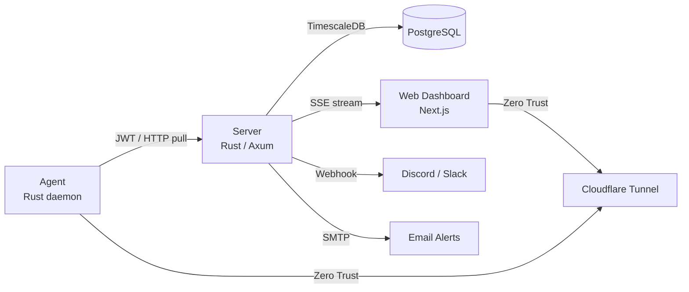

# NetSentinel

> Real-time server infrastructure monitoring — lightweight, self-hosted, and zero-trust.


---

## Overview

**NetSentinel** is a pull-based server monitoring system built with Rust and Next.js. A central server scrapes lightweight agents installed on each target host, stores metrics in TimescaleDB, and streams real-time data to the web dashboard via SSE.

**What sets it apart:**
- **Pull-scraping behind Zero Trust.** The server reaches agents over Cloudflare Tunnel, so hosts behind NAT or a firewall are monitored without opening a single inbound port.
- **Binary agent protocol, gzipped.** Agents serve `bincode` over HTTP — not JSON, not Prometheus text — with `tower-http` gzip on top, so scrape payloads stay small over tunneled links.
- **Time-range-aware TimescaleDB query routing.** `≤6h` hits raw 10 s metrics; `6h–14d` reads the 5-min continuous aggregate; `>14d` re-aggregates that CA to 15-min buckets. Long-range charts never scan the raw hypertable.
- **One stack instead of four.** Host metrics, Docker state, HTTP/Ping external monitors, and multi-channel alerting (Discord / Slack / Email) live in a single self-hosted service — no Prometheus + Uptime Kuma + Alertmanager + Grafana to wire together.
- **Streaming SSE dashboard.** Status and metrics push over one SSE connection; the client batches bursts of up to 100 events into a single React render via `requestAnimationFrame`.
- **Event-driven Docker cache.** The agent subscribes to the Docker Events API instead of polling `docker ps`, keeping container state fresh with effectively zero daemon load between events.
- **NVIDIA and Apple Silicon GPU in one agent.** NVML and macmon are both wired in behind Cargo feature flags — the same binary handles a CUDA rig or an M-series Mac.
- **Single-binary Rust for both server and agent.** No Python runtime, no JVM, no sidecars. The agent runs comfortably on a Raspberry Pi.

---

## Architecture



**Data flow:**
1. Server scrapes each registered agent every 10 s (configurable), batch-inserts metrics in a single query
2. Metrics stored in TimescaleDB hypertable (90-day retention) + 5-min continuous aggregate for fast long-range queries
3. Browser connects to SSE stream for real-time updates (10 s push, in-memory — no DB hit, rAF-batched)
4. REST API with automatic downsampling: ≤6h raw, 6h-3d 1-min, 3d-14d 5-min (CA), >14d 15-min (CA)
5. Alerts delivered to Discord, Slack, and/or Email channels

---

## Monorepo Structure

```
netsentinel/
├── netsentinel-server/   # Rust/Axum backend (metrics API, scraper, alerts)
├── netsentinel-web/      # Next.js frontend dashboard
└── netsentinel-agent/    # Rust agent daemon
```

---

## Quick Start

### Prerequisites
- Docker & Docker Compose
- A [Cloudflare Tunnel](https://developers.cloudflare.com/cloudflare-one/connections/connect-networks/) token (optional — remove the `tunnel` service for local-only use)

### 1. Clone the repository

```bash
git clone https://github.com/sounmu/netsentinel.git
cd netsentinel
```

### 2. Configure environment

```bash
cp .env.example .env
cp netsentinel-server/.env.example netsentinel-server/.env
```

Edit both `.env` files and fill in:
- `POSTGRES_PASSWORD` — strong password for PostgreSQL
- `JWT_SECRET` — 32+ byte random hex (`openssl rand -hex 32`)
- `CLOUDFLARE_TUNNEL_TOKEN` — from Cloudflare Zero Trust dashboard

### 3. Create the shared Docker network

```bash
docker network create shared-network
```

### 4. Start the stack

```bash
docker compose up -d --build
```

The dashboard is available at `http://localhost:3001` (or via your Cloudflare Tunnel domain).

---

## Running Without Docker (Development)

### Server

```bash
cd netsentinel-server
cp .env.example .env  # fill in values
cargo run
# Runs on http://0.0.0.0:3000 by default
```

### Web Dashboard

```bash
cd netsentinel-web
cp .env.example .env  # fill in NEXT_PUBLIC_API_URL
npm install
npm run dev
# Runs on http://localhost:3001
```

### Agent

```bash
cd netsentinel-agent
cp .env.example .env  # fill in JWT_SECRET matching the server
cargo run
# Listens on http://0.0.0.0:9101 by default
```

---

## Environment Variables

### Root `.env` (Docker Compose)

| Variable | Required | Default | Description |
|---|---|---|---|
| `POSTGRES_USER` | No | `postgres` | DB username |
| `POSTGRES_PASSWORD` | **Yes** | — | DB password |
| `POSTGRES_DB` | No | `network_monitor` | DB name (kept for backward compat) |
| `CLOUDFLARE_TUNNEL_TOKEN` | No | — | Cloudflare Tunnel token |
| `NEXT_PUBLIC_API_URL` | No | `http://localhost:3000` | Backend URL seen by browser |

### Server `netsentinel-server/.env`

| Variable | Required | Default | Description |
|---|---|---|---|
| `DATABASE_URL` | **Yes** | — | PostgreSQL connection string |
| `JWT_SECRET` | **Yes** | — | HS256 secret (min 32 chars). `openssl rand -hex 32` |
| `ALLOWED_ORIGINS` | No | `http://localhost:3001` | Comma-separated CORS origins |
| `SERVER_HOST` | No | `0.0.0.0` | Bind address |
| `SERVER_PORT` | No | `3000` | Bind port |
| `SCRAPE_INTERVAL_SECS` | No | `10` | How often to pull each agent |
| `MAX_DB_CONNECTIONS` | No | `10` | PostgreSQL pool size |
| `SSE_BUFFER_SIZE` | No | `128` | SSE broadcast channel buffer |
| `TRUSTED_PROXY_COUNT` | No | `0` | Reverse proxy count for X-Forwarded-For (0 = use peer IP directly) |

### Agent `netsentinel-agent/.env`

| Variable | Required | Default | Description |
|---|---|---|---|
| `JWT_SECRET` | **Yes** | — | Must match server's `JWT_SECRET` |
| `AGENT_PORT` | No | `9100` | Port the agent HTTP server listens on |
| `AGENT_HOSTNAME` | No | OS hostname | Display name shown in dashboard |

---

## API Endpoints

All endpoints require `Authorization: Bearer <JWT>` unless noted. Mutation endpoints require admin role.

| Method | Path | Description |
|---|---|---|
| `POST` | `/api/auth/login` | Login **(no auth)** |
| `POST` | `/api/auth/setup` | Create initial admin **(no auth, first run only)** |
| `GET` | `/api/auth/me` | Current user info |
| `GET` | `/api/auth/status` | Check if setup needed **(no auth)** |
| `PUT` | `/api/auth/password` | Change current user's password |
| `GET` | `/api/health` | Health check — verifies DB **(no auth)** |
| `GET` | `/api/dashboard` | Get user's dashboard layout |
| `PUT` | `/api/dashboard` | Save user's dashboard layout |
| `GET` | `/api/hosts` | List all hosts with online status |
| `GET` | `/api/hosts/{host_key}` | Get a single host configuration |
| `POST` | `/api/hosts` | Register a new host |
| `PUT` | `/api/hosts/{host_key}` | Update host configuration |
| `DELETE` | `/api/hosts/{host_key}` | Delete a host |
| `GET` | `/api/metrics/{host_key}` | Recent 50 metric rows |
| `GET` | `/api/metrics/{host_key}?start=&end=` | Metrics in a time range (ISO 8601) |
| `POST` | `/api/metrics/batch` | Batch metrics for multiple hosts (max 50) |
| `GET` | `/api/uptime/{host_key}?days=` | Daily uptime breakdown |
| `GET` | `/api/alert-configs` | Global alert defaults |
| `PUT` | `/api/alert-configs` | Update global defaults |
| `GET` | `/api/alert-configs/{host_key}` | Host-specific alert overrides |
| `PUT` | `/api/alert-configs/{host_key}` | Upsert host alert overrides |
| `DELETE` | `/api/alert-configs/{host_key}` | Delete host overrides |
| `GET` | `/api/notification-channels` | List notification channels |
| `POST` | `/api/notification-channels` | Create channel |
| `PUT` | `/api/notification-channels/{id}` | Update channel |
| `DELETE` | `/api/notification-channels/{id}` | Delete channel |
| `POST` | `/api/notification-channels/{id}/test` | Send test notification |
| `GET` | `/api/alert-history?host_key=&limit=` | Alert event log |
| `GET` | `/api/http-monitors` | List HTTP monitors |
| `POST` | `/api/http-monitors` | Create HTTP monitor |
| `GET` | `/api/http-monitors/summaries` | HTTP monitor summaries |
| `PUT` | `/api/http-monitors/{id}` | Update HTTP monitor |
| `DELETE` | `/api/http-monitors/{id}` | Delete HTTP monitor |
| `GET` | `/api/http-monitors/{id}/results` | HTTP check results |
| `GET` | `/api/ping-monitors` | List Ping monitors |
| `POST` | `/api/ping-monitors` | Create Ping monitor |
| `GET` | `/api/ping-monitors/summaries` | Ping monitor summaries |
| `PUT` | `/api/ping-monitors/{id}` | Update Ping monitor |
| `DELETE` | `/api/ping-monitors/{id}` | Delete Ping monitor |
| `GET` | `/api/ping-monitors/{id}/results` | Ping check results |
| `GET` | `/api/public/status` | Public status page data **(no auth)** |
| `GET` | `/metrics` | Prometheus metrics export **(no auth)** |
| `GET` | `/api/stream?key=<JWT>` | SSE stream (`metrics` + `status`) |

---

## Database Schema

| Table | Description |
|---|---|
| **`metrics`** | TimescaleDB hypertable, 90-day retention, 1-day chunks, compression after 7 days. Stores CPU, memory, load, network, disk, process, temperature, GPU, Docker, port data as JSONB. |
| **`metrics_5min`** | Continuous aggregate over `metrics`. 5-min buckets with AVG (cpu/memory/load), MAX (network bytes), bool_and (online), COUNT (samples). 90-day refresh policy. |
| **`hosts`** | Agent registry (scrape interval, thresholds, monitored ports/containers) |
| **`alert_configs`** | Alert rules; `NULL host_key` = global default, per-host rows override. Supports cpu/memory/disk metric types. |
| **`notification_channels`** | Alert delivery targets (Discord webhook, Slack webhook, Email SMTP). Config stored as JSONB. |
| **`dashboard_layouts`** | Per-user dashboard widget layout (JSONB). |
| **`users`** | User accounts with Argon2 password hashing. Roles: admin, viewer. Tracks `password_changed_at` for token revocation. |
| **`alert_history`** | Immutable log of all alert events with timestamps. TimescaleDB hypertable, 90-day retention, compression after 7 days. |
| **`http_monitors`** | External HTTP endpoint monitors with check intervals. |
| **`http_monitor_results`** | HTTP check results (status code, response time, errors). TimescaleDB hypertable, 90-day retention, compression after 7 days. |
| **`ping_monitors`** | Network host reachability monitors (TCP connect). |
| **`ping_results`** | Ping check results (RTT, success/failure). TimescaleDB hypertable, 90-day retention, compression after 7 days. |

---

## Tech Stack

| Component | Technology |
|---|---|
| Backend | Rust, Axum 0.8, sqlx 0.8, TimescaleDB, lettre (SMTP) |
| Frontend | Next.js 16, React 19, Recharts, SWR, sonner (toast) |
| Agent | Rust, tokio, sysinfo, bollard (Docker), nvml-wrapper (NVIDIA GPU) |
| Database | PostgreSQL 15 + TimescaleDB extension |
| Deployment | Docker Compose, Cloudflare Tunnel |

---

## Contributing

See [CONTRIBUTING.md](./CONTRIBUTING.md) for development setup, coding conventions, and the PR process.

---

## License

[Apache License 2.0](./LICENSE) © 2026 sounmu
